V3的核心是通过盘口区间提供流动性（集中式流动性），解决LP提供流动性时的资金利用率的问题。

uniswap官方有关V3的资料

- [V3官方介绍](https://uniswap.org/blog/uniswap-v3)

- [技术白皮书](https://uniswap.org/whitepaper-v3.pdf)

- 智能合约代码
  - [v3-core](https://github.com/Uniswap/v3-core)
  - [v3-periphery](https://github.com/Uniswap/v3-periphery)

参考: 

[uniswap - V3技术白皮书导读](https://zhuanlan.zhihu.com/p/365746073)

[技术白皮书](https://uniswap.org/whitepaper-v3.pdf)

## 资金利用率

### v2中资金利用率

​	在交易池中A,B两种代币的价格一般是在一个价格区间中波动，因此实际能消耗的代币数量也是在一个区间中，但是提供流动性所需要的数量是远大于这个实际消耗的数量的，这就导致了很多闲置的代币。因此v2中的资金利用率是很低的。

### v3如何解决资金利用率低的问题

uniswap V3就是尝试解决资金利用率低的问题。想法比较简单，所有资金可以只添加到某个区间，只添加到有可能价格波动到的区间范围。如何在某个区间添加流动性并提供swap功能是uniswap V3的重点。先从Virtual Reserves说起。

## 虚拟资金池（Virtual Reserves)

uniswap的交易采用的乘积固定模型(`X * Y = K`)。所谓的虚拟资金池(`Virtual Reserves`)，是指在乘积K固定曲线上，只提供某个区间流动性的资金池

如何计算在某个区间提供虚拟资金池，先深入理解流动性。

## 流动性（Liquidity - L）

v2中添加流动性公式：

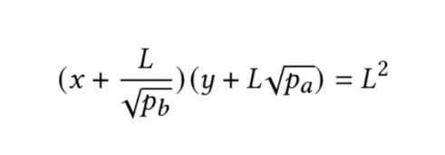

乘积固定的交易模型，满足资金池中的两种代币金额满足：x*y = K。如果设定K=L^2的话，x*y = L^2。L就是我们说的流动性。由乘积固定的交易模型得出如下的公式：

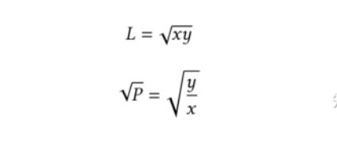

在已知L和sqrt(P)的情况下，也能推导出资金需求量x和y。

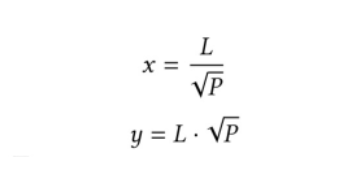

在流动性不变的情况下（不添加删除流动性），流动性可以看成是单位“价格波动”的y资金量的变化。”价格波动“打上引号是因为事实上是sqrt(P)的变化。

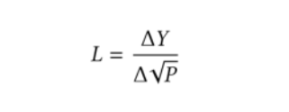

这个是uniswap V3核心公式，**用相对值（资金和价格相对值）来计算流动性**。所谓的流动性，就是单位“价格变化”的资金量。在一定的交易量的情况下，如果流动性好，价格变化就小，流动性不够的话，价格波动就大。

特别注意的是，一个区间上的流动性和V2的普适的流动性不同。一个区间上的流动性，重点在“区间上”。不同区间的流动性没有可比性。V2的流动性和区间上的流动性的区别如下图：

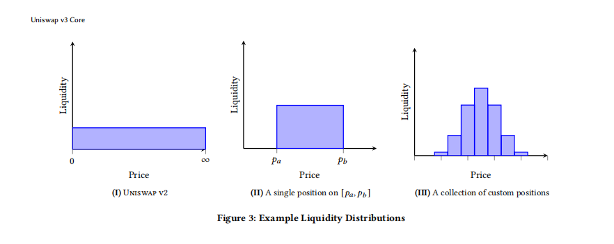

V2的流动性是“普适”的，在所有价格点上流动性相同。V3的流动性是由一系列不同区间上的流动性组成。相对来说，在当前价格左右的流动性比较高。流动性提供者LP只有提供了可供交易的流动性才能获取交易费。为了获取更多的交易费，为了提高资金的利用率，流动性提供者会将资金提供在合理的价格波动范围内。也就是说，在某个区间swap交易产生的手续费，只有该区间流动性提供者才能获取手续费。为了计算每个区间获取的手续费，引入了Tick的概念和计算方法。

## Tick

在区间上提供流动性，带来很多复杂的情况：区间和区间的重叠覆盖。因为不同区间的流动性没有可比性，某个交易费并不能混入到流动资金中，等删除流动性时候一并提取。为了解决这个问题，uniswap V3引入了Tick的概念。交易费用实时结算并单独记录，并不混入流动资金中。虽然整个区间和区间的流动性没有可比性，但是，在具体的某个价格点上（一个价格片上），流动性是可比较的。uniswap V3将整个价格范围(负无穷到正无穷)分成一个个的Tick（价格点）：

每个Tick也有一个唯一的序号。区间（Position）可以由两个Tick表示。逻辑上交易手续费可以一个个的Tick计算，并在每一个Tick上根据流动性的占比进行交易分配。先看看一个Tick范围的swap的计算。

**5Tick内的SWAP**

假设有一个很小的量的y，需要swap为x。通过公式，可以计算出因为y的变化导致的价格变化。

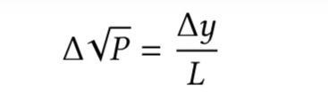

可以算出换取的x的量。

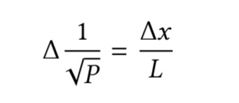

uniswap V3针对同样的交易对设置了不同的交易费：0.05%，0.3%以及1% （还可以添加其他费率）。如果是从Y换取X，则在换取之前先扣除手续费再进行上述的交换。

在同一交易池中只支持一种费率。也就是说，在一个交易池中支持不同的价格区间，但是都是同样的费率。如果需要添加同样交易对的不同交易费的交易池，必须创建新的交易池。

接下来，深入讲解一下 添加/删除流动性以及交易费用的计算逻辑。

##  添加/删除流动性

V3的添加/删除流动性是当前价格情况下在某个区间添加或者删除流动性。所有的流动性添加/删除流动性采用如下的公式：

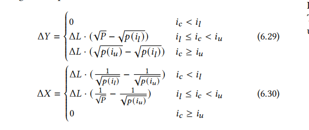

注意，价格变化并不是指区间的大小，而是在某个区间上提供流动性，相对当前价格，“需要相应资金变化”对应的价格变化。

分为三种情况，想要添加的流动性区间和当前价格的关系。

-  当前价格处于流动性价格区间 (il <= ic < iu)

  因为价格在区间范围内，如果价格滑动到il，则需要提供y资金。如果价格滑动到iu，则需要提供相应的x资金。所以，对于delta_Y来说的，价格变化为sqrt(P) - sqrt(p(il))；对于delta_X来说，价格变化为1/sqrt(P) - 1/sqrt(p(iu))。

- 当前价格低于流动性价格区间

  因为当前价格远低于il，即使从当前价格向iu滑动，也只需要x的资金，不需要y的资金。所以，在这种情况下，delta_Y = 0。因为从il滑向iu需要整个区间的x的资金，对于delta_X来说，价格变化为1/sqrt(il) - 1/sqrt(p(iu))。

- 当前价格高于流动性价格区间

  和第一种情况类似

## Swap交易费用

uniswap最复杂的逻辑是计算交易费用并分配。在添加和删除流动性之前需要将相应的交易费用提取。

###  **Tick上的总流动性**

在某个Tick上可以存在多个区间。在计算交易费用时，需要平摊这些费用给所有在这个Tick上多个区间的总的流动性。在每个区间的边界的Tick上记录下delta_L（所有以这个Tick为边界的区间的流动性总和）。

存在一个全局状态：liquidity，保存当前价格对应Tick的流动性总和。当价格波动，穿过某个Tick时，会进行流动性的增加或者减少（取决于价格波动方向）。举例来说，价格从左到右穿过区间，当穿过区间的第一个Tick时，流动性需要增加，穿出最后一个Tick时，流动性需要减少，中间的Tick都没有流动性的增加和减少（delta_L为0）。

- **区间（Position）上的交易费用率**

计算一个区间上的交易费用率，采用总的费用率减去区间外的费用率的方法。在一个区间的边界Tick上记录feeGrowthOutside。所谓的feeGrowthOutside，就是“另外”一个方向上总的费用率。另外的一个方向是相对穿过当前Tick的方向而言。当价格从左到右穿过一个Tick，feeGrowthOutside指的是Tick左边所有区间的费用率。简单的说，就是价格要去方向的相反方向所有区间的费用率。feeGrowthOutside用fo表示。因为fo是一个Tick的两个方向的总的费用率，两个方向的费用率的总和肯定是等于fg（全局的费用率）。所以当穿过一个Tick时，这个Tick上的fo要进行翻转：

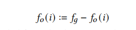

当一个区间创建时，区间边界上Tick的fo需要初始化：

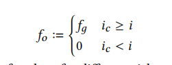

如果当前的价格大于Tick的价格时，因为即使当前价格在设置的区间内，但是之前费用也不会分到，所以，可以简单的假想为所有的费用发生在Tick价格之下，也就是fo=fg。如果Tick的价格大于当前价格，价格还没有穿过Tick，因为假设了之前所有发生的费用发生在Tick价格之下，Tick之上是没有费用的，所以fo=0。在理解了这些逻辑的基础上，在swap的过程中，随着价格的波动，一个区间上，超过最高Tick的费用率以及低于最低Tick的费用率可以用如下的方式计算：

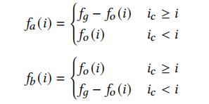

以低于最低Tick的费用率的计算为例，如果ic>=i （当前的价格是高于最低Tick的），低于Tick的所有的费用率就是fo（定义如此）。如果ic<i的情况下，fo记录的是高于Tick的所有费用率，所以需要翻转，即fg - fo。在获取了一个区间外的所有费用的情况下，计算本区间的费用率：

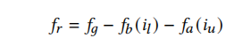

获取的费用率的基础上，用费用率乘以区间的流动性可以计算出该区间收取的费用。

## **总结：**

uniswap V3版本核心思想是流动性集中。流动性提供者可以在某个区间提供流动性，提高资金使用率。在某个区间获取的交易费，由所有在该区间的流动性提供者均分。uniswap V3设计了区间粒度-Tick，并且推导了流动性添加/删除以及费用计算的过程。在之基础上，uniswap V3也更新了价格预言机的实现。

其他链接：

- [Uniswap v3 设计详解](https://zhuanlan.zhihu.com/p/448382469)

  